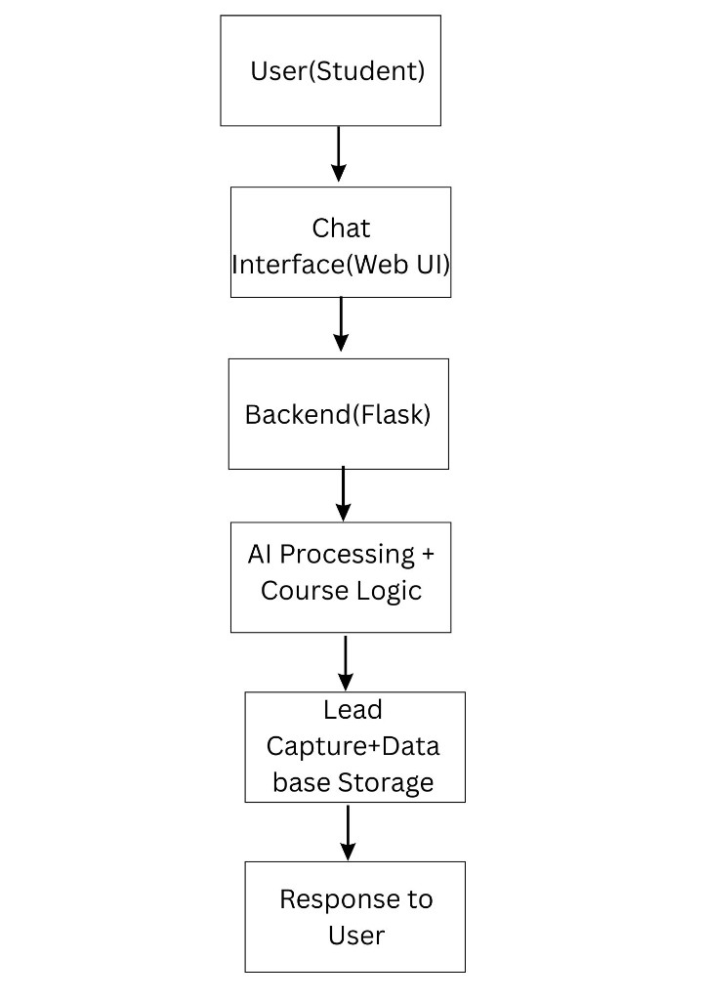

# AI-Powered Course Enquiry Assistant

Minimal Flask web app prototype for handling educational course enquiries, sharing course details, capturing leads, and doing basic follow-up.

## Tech Stack

- Python 3
- Flask
- HTML / CSS / JavaScript
- SQLite
- OpenAI API (optional)

## Features

- Chat-style web interface (HTML/CSS/JS)
- Query handling for:
  - "What courses do you offer?"
  - "AI course fees"
  - "Duration of data science course"
- Predefined course catalog:
  - AI & ML
  - Data Science
  - Web Development
- Lead capture flow:
  - Name
  - Phone
  - Course interest
- SQLite lead storage in `leads.db`
- Follow-up question after lead save ("Would you like a brochure?")
- Optional AI response layer using OpenAI API, with rule-based fallback
- Session-based conversation state tracking

## Workflow (Input -> Process -> Output)

1. **Input Handling**
   - User sends message from chat UI to `/chat` via AJAX POST.
2. **Intent Detection**
   - `detect_intent()` classifies message using conversation stage + keywords.
3. **Response Generation**
   - `generate_response()` builds course answer or lead-capture prompt.
   - If OpenAI key is configured, app can generate short AI answers first.
4. **Lead Storage**
   - `save_lead()` inserts `name`, `phone`, `course`, `timestamp` into SQLite.
5. **Output**
   - Bot reply is returned as JSON and rendered in chat UI.

### Workflow Diagram



## Project Structure

```text
project/
├── app.py
├── assets/
│   └── workflow-diagram.png
├── templates/
│   └── index.html
├── static/
│   └── style.css
├── leads.db            (auto-created on first run)
├── requirements.txt
└── README.md
```

## Setup

1. Create and activate virtual environment (recommended):

   ```bash
   python -m venv .venv
   # Windows
   .venv\Scripts\activate
   # macOS/Linux
   source .venv/bin/activate
   ```

2. Install dependencies:

   ```bash
   pip install -r requirements.txt
   ```

3. Optional: enable OpenAI API layer:

   ```bash
   # Windows PowerShell
   $env:OPENAI_API_KEY="your_api_key_here"
   ```

4. Run app:

   ```bash
   python app.py
   ```

5. Open browser:
   - [http://127.0.0.1:5000](http://127.0.0.1:5000)

## Notes

- Without `OPENAI_API_KEY`, the assistant uses keyword-based rules only.
- Lead capture sequence is:
  1. Name
  2. Phone
  3. Course interest
- Data is stored in SQLite table:
  - `leads(id, name, phone, course, timestamp)`
